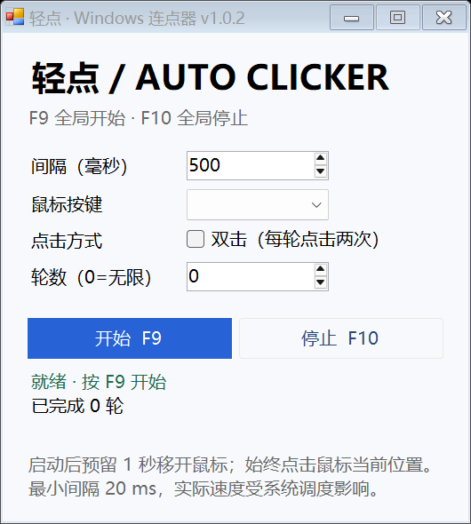

# Qingdian Auto Clicker · 轻点

A small, open-source Windows auto clicker with a Chinese desktop UI. **F9 starts; F10 stops**, globally. No network access, telemetry, or third-party runtime packages.

[中文](README.md) · [Downloads](https://github.com/Liang5757/qingdian-auto-clicker/releases) · [Contributing](CONTRIBUTING.md)



## Features

- Configurable interval from 20 ms to one hour.
- Left, right, or middle button; single or double clicks.
- A fixed number of rounds, or unlimited rounds. A double-click round contains two clicks.
- Click at the current pointer location without moving the pointer.
- One-second delay before clicking starts.
- Local settings persistence; single instance; startup disabled if the stop hotkey is unavailable.

## Run

Download and extract a release ZIP, then run `Qingdian.AutoClicker.exe`. Requires Windows 10/11 and .NET Framework 4.8 or newer 4.x. The development SDK is not required. Releases are currently unsigned.

Settings live in `%LOCALAPPDATA%\WindowsAutoClicker\settings.xml`. Exit the app and delete that file to reset settings. Delete the extracted folder to uninstall; settings can be deleted separately.

Since v1.0.1, a worker samples F10 state approximately every 10 ms and latches stop requests independently of `WM_HOTKEY`. The UI checks before each click and during startup delay. Modifier keys do not prevent this fallback. Sampling can miss very short presses and remains subject to Windows desktop access restrictions; it is not a guarantee for secure desktops or intercepted input. The status text identifies which stop path fired.

## Build and test

On Windows, install .NET SDK 8.0.200 or a newer 8.0 feature band:

```powershell
powershell -NoProfile -ExecutionPolicy Bypass -File scripts/build.ps1
powershell -NoProfile -ExecutionPolicy Bypass -File scripts/package.ps1
```

The solution uses SDK-style projects targeting .NET Framework 4.8. Locked NuGet restore, compilation, and xUnit tests must pass before packaging. ZIP and SHA-256 files are written to `artifacts/`.

## Limits

Windows scheduling affects timing. Elevated targets may require matching privileges; some applications ignore synthetic input. Secure/locked desktops are unsupported. Use only where automation is permitted.

Automated tests cover logic, persistence, native layout, and message handling, not end-to-end input delivery on every desktop. Full manual Windows/DPI/privilege acceptance is still pending; see [testing](docs/TESTING.md).

Licensed under [MIT](LICENSE). See [architecture](docs/ARCHITECTURE.md), [contributing](CONTRIBUTING.md), and [security](SECURITY.md).
